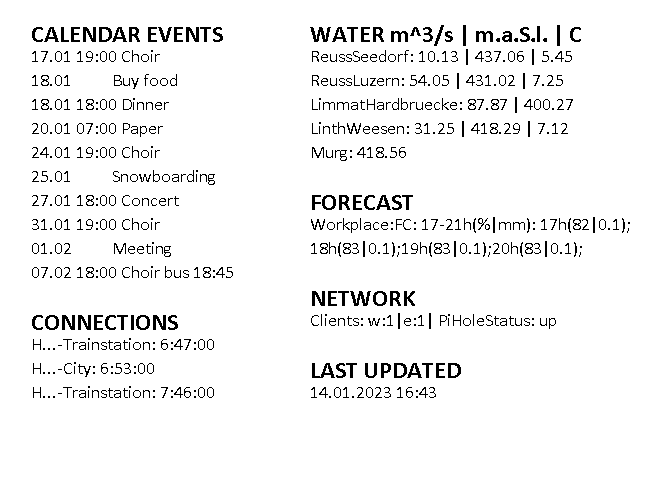
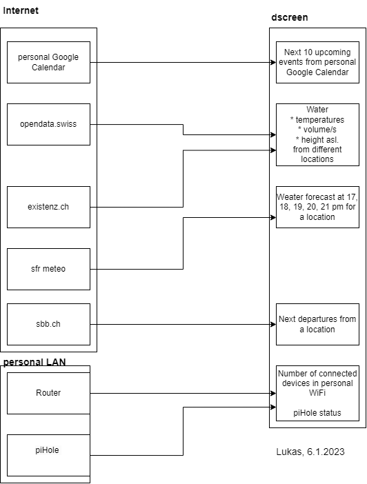

# dscreen  
This project is a personal information screen installed at the appartment door to show todays information. The display is going to be updated every 30 min.
# content
* Next 10 upcoming events of the personal gmail calendar  
* SBB departures from busstop  
* Watertemperatures, -level and -flowrate of given locations  
* SRF Meteo rain probability forecast for the current day at 17-21h 
* Number of connected devices in the home network  
* Status of piHole in the home network   
* Last updated timestamp  
## sample content

## config files
### .dscreen-config
Config for content (SBB station id, content addresses, waterfun location IDs)
### .dscreen-cred
Credentials for google-calendar...
## dataflow
  
## hardware  
Raspberry Pi Zero WH  
waveshare epd_5in83b_v2  
## software
Raspbian Bullseye (11)  
bcm2835-1.60
Python 3.9.2  
waveshare sample project https://github.com/waveshare/e-Paper 
### debugging of the project
When running in Visual Studio Code no display needed, an image is created.
### installation of the project
1 flash uSD card (4GB+) with latest Raspbian OS  
2 activate ssh (Raspberry Pi Imager has an option or create an empty file in /boot called "ssh")  
3 connect the parts together (see waveshare manual)  
4 startup the Raspberry Pi  
5 login into Raspberry Pi using ssh  
6 install using this command: $ wget https://raw.githubusercontent.com/ClimbTheWorld/dscreen/main/bootstrap_dscreen.sh && chmod +x bootstrap_dscreen.sh && sudo ./bootstrap_dscreen.sh  
Raspberry does reboot. Login again and do $ sudo ./bootstrap_dscreen.sh  
### Links
#### e-Paper
https://www.waveshare.com/w/upload/8/89/5.83inch-e-paper-hat-user-manual-en.pdf  
https://www.waveshare.com/wiki/5.83inch_e-Paper_HAT_(B)  
