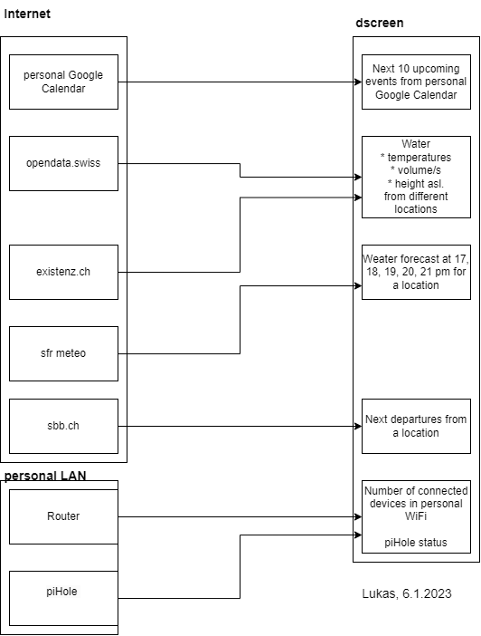

# dscreen  
This project is a data viewer which collects data from different source using REST api and shows it on a e-paper display.  
## sample content

# hardware  
Raspberry Pi Pico HW  
waveshare epd_5in83b_v2  
### epd_5in83B_V2
#### links
https://www.waveshare.com/w/upload/8/89/5.83inch-e-paper-hat-user-manual-en.pdf  
https://www.waveshare.com/w/upload/8/89/5.83inch-e-paper-hat-user-manual-en.pdf  
https://www.waveshare.com/wiki/5.83inch_e-Paper_HAT_(B)  

# content
## dataflow
  

** Wassertemperaturen (Murg, LuzernReuss, LuzernSee, SeedorfReuss) done  
** Bielihüüssolar  
** SBB ab Himmelrich DONE  
** Kalender Lukas  
** Kalender Allgemein  
** Menü für heute / Einkaufsliste (Knopf für das Senden an Email/Kalendereintrag)  
** Regenjacke?  
Meteo (50 req/day in 'Freemium' plan)    
Token: https://developer.srgssr.ch/user/me/apps?destination=user/me/apps  
Forecast:  
** number of clients in last 24h  
** phile stats DONE  
GET http://pihole-ip/admin/api.php  
